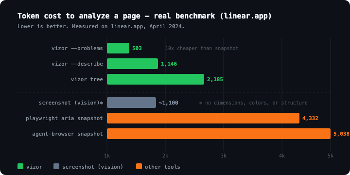
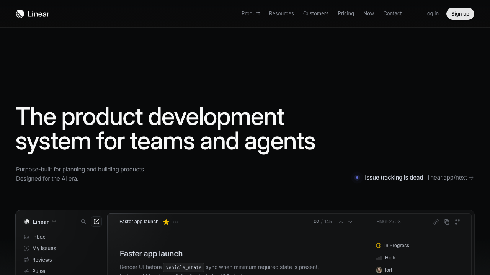

# Vizor CLI

Headless layout analysis tool for AI agents. Extracts page structure, computed styles, and detects UX problems — **as compact text, not screenshots**.

```bash
vizor https://linear.app --problems    # 503 tokens
vizor https://linear.app --describe   # 1,146 tokens
vizor https://linear.app              # 2,185 tokens
```

vs **4,332–5,038 tokens** for a Playwright/agent-browser accessibility snapshot, and **zero structural information** from a raw screenshot.

---

## vs Playwright & agent-browser — Real Benchmark

Tested on [linear.app](https://linear.app), April 2024. Same site, same task: *"what layout problems exist?"*



| Tool | Output | Tokens | Has dimensions? | Has colors? | Has problems list? |
|------|--------|--------|----------------|-------------|-------------------|
| **vizor --problems** | text | **503** | — | — | ✅ auto-detected |
| **vizor --describe** | text | **1,146** | ✅ | ✅ palette | — |
| **vizor tree** | text | **2,185** | ✅ exact px | ✅ hex | — |
| Screenshot (vision) | image | ~1,100 | ❌ | ❌ | ❌ |
| Playwright ARIA | text | 4,332 | ❌ | ❌ | ❌ |
| agent-browser snapshot | text | 5,038 | ❌ | ❌ | ❌ |

**vizor `--problems` is 10× cheaper than an accessibility snapshot, and actually tells you what's broken.**

### What each tool outputs

<details>
<summary><strong>vizor --problems</strong> — 503 tokens, structured problem list</summary>

```
PROBLEMS: https://linear.app (viewport: 430×932)
────────────────────────────────────────
⚠️  overflow: [div.Marquee_root] 836×28 at (-8, 909) — 836 > 430 viewport
⚠️  hidden-clip: [div.Frame_background] 430×400 at (0, 475)
⚠️  tiny-tap: [a "Skip to content →"] 430×32 at (0, 72) — min 44×44 for touch
⚠️  low-contrast: [a "Get started"] — 1.00:1 #08090a on #08090a, need 4.5
⚠️  no-label: [a.Logos_logosLink] — needs text, aria-label, or title
⚠️  spacing: [div.LayoutContent] — mt: 33, 39, 47, 79, 7px
⚠️  z-conflict: [header z:100 vs a.SkipNav z:5000] — may overlap
Total: 16 problems
```
</details>

<details>
<summary><strong>agent-browser snapshot</strong> — 5,038 tokens, ARIA tree (no layout data)</summary>

```yaml
- document:
  - banner:
    - navigation "Main":
      - list "Site navigation":
        - listitem:
          - link "Navigate to home":
            - img "Linear"
        - listitem:
          - list:
            - listitem:
              - button "Product"
            - listitem:
              - button "Resources"
            ...  (continues for 300+ lines, no dimensions, no colors)
```
</details>

<details>
<summary><strong>Screenshot</strong> — ~1,100 vision tokens, pixels only</summary>

| | agent-browser PNG (92 KB) | vizor WebP (95 KB, full page) |
|--|--|--|
| |  | Full page — [see below](#screenshots--optimization) |

The screenshot shows *how it looks*, not *what's wrong*. No dimensions. No color values. No tap-target sizes. The AI has to guess.
</details>

---

## Install

```bash
# Self-contained: downloads playwright + chromium on first run (~165MB, one-time)
curl -fsSL https://raw.githubusercontent.com/serter2069/vizor/main/vizor.js -o vizor && chmod +x vizor

# Or via npm
npm install -g vizor-cli
```

No configuration needed. First run bootstraps its own isolated Playwright runtime into `~/.vizor`.

---

## Quick Start

```bash
vizor https://myapp.com --problems         # detect layout/UX issues
vizor https://myapp.com --describe         # palette, fonts, layout summary
vizor https://myapp.com                    # full layout tree
vizor https://myapp.com --compare          # mobile vs desktop side-by-side
vizor https://myapp.com --ss /tmp/out.webp # optimized full-page screenshot
```

---

## Analysis Modes

| Flag | Tokens (typical) | What it does |
|------|-----------------|-------------|
| `--problems` | **~500** | Detected layout/UX issues only |
| `--describe` | **~1,100** | Design summary: palette, typography, layout structure |
| _(default)_ | **~2,000** | Full layout tree — dimensions, colors, spacing, position |
| `--aria` | ~2,000 | ARIA tree (roles, labels, hierarchy) |
| `--hover SEL` | ~300 | Style delta when hovering a selector |
| `--compare` | ~4,000 | Mobile (430×932) vs desktop (1440×900) side-by-side |
| `--sweep` | ~5,000 | 5 viewports: 320, 430, 768, 1024, 1440px |
| `--sweep-viewports W1xH1,...` | varies | Custom viewport list |
| `--diff FILE` | ~500 | Changed elements vs saved baseline |

---

## Problem Detection (10 types)

| Problem | What it finds |
|---------|--------------|
| `overflow` | Element wider than viewport without scrollable parent |
| `hidden-clip` | `overflow:hidden` clips visible content |
| `tiny-tap` | Interactive element smaller than 44×44px (touch target) |
| `tiny-text` | Font size < 12px |
| `low-contrast` | Text contrast ratio below WCAG AA threshold (4.5:1) |
| `offscreen` | Element completely outside viewport |
| `no-label` | Button/link with no text or aria-label |
| `clickable-no-role` | `div` with onclick but no `role="button"` |
| `ghost` | Large invisible element (opacity:0) covering content |
| `spacing` | Inconsistent margins between siblings |
| `z-conflict` | Fixed/sticky elements with overlapping z-index |

---

## Screenshots & Optimization

```bash
# Full-page WebP (sharp auto-installed, ~25MB one-time)
vizor https://myapp.com --ss /tmp/out.webp           # mobile 430px, full page
vizor https://myapp.com --ss /tmp/out.webp --desktop  # desktop 1440px, full page
vizor https://myapp.com --ss /tmp/out.webp --viewport 768x1024

# Control quality and width
vizor https://myapp.com --screenshot /tmp/out.jpg    # JPEG quality 70 (native, no deps)
vizor https://myapp.com --screenshot /tmp/out.webp --screenshot-quality 40 --screenshot-width 800

# Mid-flow screenshot
vizor https://myapp.com --click ".menu" --screenshot /tmp/menu.jpg --problems
```

**File size comparison on the same page (linear.app, mobile viewport):**

| Format | Size | Tokens (vision) | Notes |
|--------|------|-----------------|-------|
| PNG | 103 KB | ~680 | baseline |
| JPEG q70 | 32 KB | ~680 | native Playwright, no deps |
| **WebP q55** | **17 KB** | ~680 | 6× smaller, sharp auto-install |
| WebP q55 full-page | 95 KB | ~3,400 | entire 430×6,530px page |

> Vision token cost is per image size, not file size — JPEG and WebP look the same to the model but are 3–6× cheaper to store/transfer.

---

## Interactive Actions

Actions run before analysis, in order. Combine freely.

```bash
# Login flow, then check layout
vizor https://app.com \
  --fill "#email" "user@example.com" \
  --fill "#password" "secret" \
  --click "button[type=submit]" \
  --wait-for ".dashboard" \
  --problems

# Assert state
vizor https://app.com \
  --click ".toggle" \
  --assert-visible ".dropdown" \
  --assert-enabled "button[type=submit]" \
  --get ".badge"   # prints text in action log

# Capture console errors alongside layout check
vizor https://app.com --console-errors --problems
```

| Action | Syntax |
|--------|--------|
| `--click SEL` | Click element |
| `--fill SEL VAL` | Clear and fill input |
| `--type SEL VAL` | Type into input (no clear) |
| `--press KEY` | Keyboard key: `Enter`, `Tab`, `ArrowDown`, … |
| `--goto URL` | Navigate mid-flow |
| `--scroll up\|down\|top\|bottom\|SEL [px]` | Scroll page or element into view |
| `--select SEL VALUE` | Select dropdown option |
| `--wait-for SEL` | Wait until selector visible (10s max) |
| `--wait-ms N` | Sleep N milliseconds |
| `--hover SEL` | Hover (also available as analysis mode) |
| `--screenshot FILE` | Save PNG/JPEG/WebP screenshot |
| `--ss FILE` | Shortcut: full-page WebP, q55, max 1200px |
| `--full-screenshot FILE` | Full-page screenshot in any format |
| `--assert-exists SEL` | Fail if selector missing |
| `--assert-text SEL TEXT` | Fail if element text lacks TEXT |
| `--assert-url TEXT` | Fail if current URL lacks TEXT |
| `--assert-visible SEL` | Fail if element not visible |
| `--assert-enabled SEL` | Fail if element not enabled |
| `--assert-checked SEL` | Fail if checkbox not checked |
| `--get SEL` | Print element text in action log |
| `--get-attr SEL NAME` | Print attribute value in action log |
| `--flow FILE` | Load actions from JSON or line-based file |
| `--actions-log` | Always print action log (default: only on failure) |
| `--console-errors` | Capture JS errors + uncaught exceptions |
| `--console-logs` | Capture all console output |
| `--cookies-load FILE` | Load cookies from JSON (before navigation) |
| `--cookies-save FILE` | Save cookies to JSON (after flow) |

---

## Multi-Tab

```bash
# Open a second tab, analyze it
vizor https://app.com --new-tab https://app.com/dashboard --problems

# Open tab, switch back to first
vizor https://app.com \
  --new-tab https://app.com/settings \
  --switch-tab 0 \
  --problems
```

| Action | Syntax |
|--------|--------|
| `--new-tab URL` | Open URL in a new tab (becomes active) |
| `--new-tab-blank` | Open blank tab |
| `--switch-tab N` | Switch active tab by index (0 = first) |
| `--close-tab` | Close active tab, switch to previous |

---

## Network Interception

```bash
# Capture all XHR/fetch requests
vizor https://app.com --net-capture --problems

# Stub an API endpoint with a fixture
vizor https://app.com --net-stub "**/api/user" fixtures/user.json --problems

# Block all API calls (test offline state)
vizor https://app.com --net-block "**/api/**" --problems
```

```
NET CAPTURE: https://app.com
────────────────────────────────────────────────────────────────
  METHOD  ST    SIZE     MS     URL
  POST    200   0.4kb    45ms   /api/auth/login
  GET     200   12.3kb   120ms  /api/user/profile
  GET     404   0.1kb    12ms   /api/missing-endpoint        !
────────────────────────────────────────────────────────────────
  3 requests  |  1 error
```

---

## Flow Files

```bash
vizor https://app.com --flow tests/login.json --problems
```

**JSON format:**
```json
[
  { "goto": "https://app.com/login" },
  { "fill": "#email", "value": "user@example.com" },
  { "fill": "#password", "value": "secret" },
  { "click": "button[type=submit]" },
  { "wait-for": ".dashboard" },
  { "assert-url": "/dashboard" },
  { "screenshot": "/tmp/result.webp" }
]
```

**Line-based format:**
```
goto https://app.com/login
fill #email user@example.com
click button[type=submit]
wait-for .dashboard
assert-url /dashboard
scroll bottom
screenshot /tmp/result.jpg
```

---

## Output Example

```
PAGE: https://app.com (viewport: 430×932)
────────────────────────────────────────────────────────────────
[body] 430x932
  [header.navbar] 430x56 flex-row bg:#1a1a2e jc:between ai:center sticky(0,_) z:100
    [div.logo "MyApp"] 99x28
    [button "Login"] 76x44 bg:#e94560 r:8
  [main] 430x1200 flex-col
    [section.hero] 430x300 flex-col ai:center p:40,16
      [h1 "Welcome"] 398x32 font:28/700 #ffffff
      [p "Browse our products"] 398x18 font:16 #a0a0b0
    [div.cards-grid] 398x424 grid-2col gap:12
      [div.card] 193x214 bg:#ffffff r:12
        [div.card-img] 193x120 bg:#dddddd
        [div.card-title "Product Name"] 169x16 font:14/600
        [div.card-price "$299"] 169x18 font:16/700 #e94560
```

---

## Setup Options

```
--viewport WxH    Viewport size (default: 430x932 mobile)
--desktop         Shortcut for --viewport 1440x900
--depth N         Max tree depth (default: 8)
--no-warnings     Hide warning flags
--wait N          Initial render wait in ms (default: 2000)
--cdp PORT        Connect to existing browser via CDP
--save FILE       Save analysis output to file

Screenshot optimization:
--screenshot-quality N    JPEG/WebP quality 1-100 (default: 70 JPEG, 55 WebP)
--screenshot-width N      Resize to max N px wide (uses sharp, auto-installed)
```

---

## How It Works

1. Launches headless Chromium via Playwright (self-installed into `~/.vizor`)
2. Navigates to URL, runs optional action flow
3. Calls `page.evaluate()` — walks the DOM, reads `getBoundingClientRect()` + `getComputedStyle()` for every visible element
4. Formats a compact text tree:
   - CSS-in-JS class names (`css-xxx`, `r-xxx`) auto-filtered
   - Unstyled wrapper divs collapsed
   - Repeated siblings collapsed (`… ×5 more div.card`)
   - Text, `aria-label`, `placeholder` used for readable selectors

---

## License

MIT
